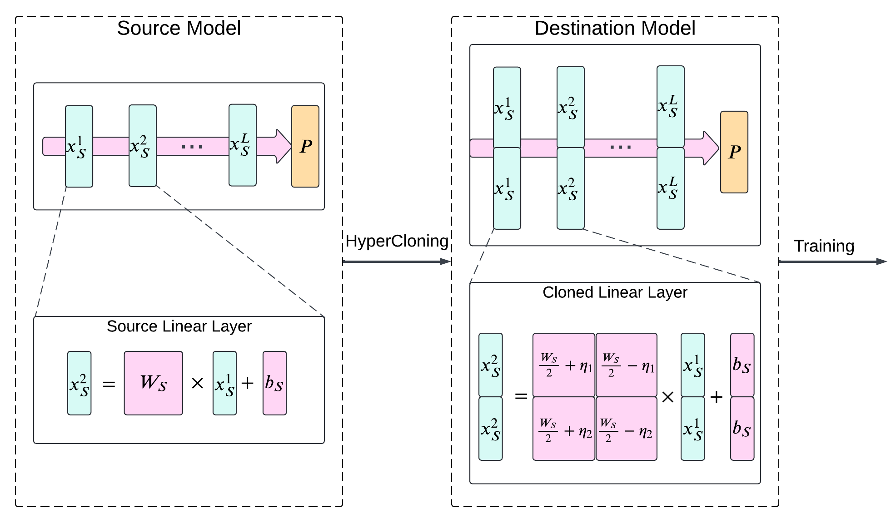

# HyperCloning

This software project accompanies the research paper, [Scaling Smart: Accelerating Large Language Model Pre-training with Small Model Initialization](https://arxiv.org/abs/2409.12903).

HyperCloning can pass the knowledge from a small pre-trained LLM to a large LLM. The larger LLM can undergo fine-tuning to get improved accuracy.



## Installation

`pip install -r requirements.txt`

## Sample Code

The following snippet shows how to clone a source model into a destination model:

```
from transformers import AutoModelForCausalLM
from hypercloning import cloneModel

# instantiate the source model (pretrained):
source_model = AutoModelForCausalLM.from_pretrained("facebook/opt-350m")

# Clone a model with 2x embedding size and 2x FFN dimension:
destination_model = cloneModel(source_model, embedding_dim_multiplier=2, up_project_multiplier=2)
```

You may modify and run the following to perform cloning on supported models:

```
python examples.py
```
## Supported Models
The following families of models are currently supported:
- [OPT](https://huggingface.co/docs/transformers/en/model_doc/opt)
- [Pythia](https://huggingface.co/models?other=pythia)
- [OLMo](https://huggingface.co/docs/transformers/en/model_doc/olmo)
- [Gemma](https://huggingface.co/docs/transformers/en/model_doc/gemma)
- [Llama](https://huggingface.co/docs/transformers/en/model_doc/llama2)

## Limitations
- The current implementation requires `embedding_dim_multiplier` and `up_project_multiplier` to be integers. fractional values are not supported.
- Although the destination network's output is valid, it may not be perfectly aligned with the source network. This can happen due to numerical precision issues.
- For Attention Layers, we suggest only changing the number of attention heads without changing the head_size for each head. Changing the head_size would make the code more complicated. 

## References

For citations, you may use the following:
```
@article{samragh2024scaling,
  title={Scaling Smart: Accelerating Large Language Model Pre-training with Small Model Initialization},
  author={Samragh, Mohammad and Mirzadeh, Iman and Vahid, Keivan Alizadeh and Faghri, Fartash and Cho, Minsik and Nabi, Moin and Naik, Devang and Farajtabar, Mehrdad},
  journal={arXiv preprint arXiv:2409.12903},
  year={2024}
}
```
